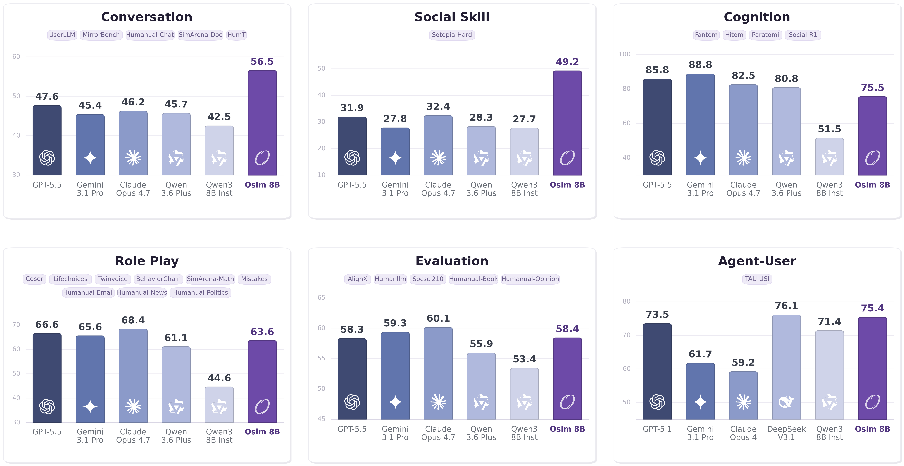

<div align="center">
  
  <h1 align="center">Building Foundation Models for Human Behavior Simulation</h1>

  [](https://opensource.org/licenses/Apache-2.0)
  [](https://huggingface.co/collections/cmu-lti/odyssim)
  [](http://arxiv.org/abs/2605.20506)
</div>

We are building **human simulators**: foundation models that imitate how
people think, feel, decide, and act across interactive scenarios. The next
foundation model should not just **answer** humans, but simulate human-side
behavior with realistic social grounding.

This repository is the training and evaluation codebase for the **OdysSim**
project. It contains the full pipeline for behavioral foundation models, from
midtraining on large-scale human-behavior data to task-specific RL,
verbal-feedback post-training, expert distillation, and SOUL evaluation.

<table>
  <tr>
    <td width="50%" valign="top">
      <a href="README_DITTO.md">
        
      </a>
      <h3>Ditto</h3>
      <p><strong>Reinforcing Human Behavior Simulation via Verbal Feedback</strong></p>
      <p>
        <a href="README_DITTO.md">Doc</a> ·
        <a href="http://arxiv.org/abs/2605.20506">Paper</a> ·
        <a href="https://huggingface.co/sunweiwei/Ditto-8B">Model</a> ·
        <a href="recipe/ditto">Recipe</a>
      </p>
    </td>
    <td width="50%" valign="top">
      <a href="assets/Building Foundation Models for Human Behavior Simulation.pdf">
        
      </a>
      <h3>OdysSim</h3>
      <p><strong>Building Foundation Models for Human Behavior Simulation</strong></p>
      <p>
        <a href="assets/Building Foundation Models for Human Behavior Simulation.pdf">Paper</a> ·
        <a href="https://huggingface.co/collections/cmu-lti/odyssim">Models</a> ·
        <a href="https://huggingface.co/datasets/cmu-lti/osim-mid-training">Data</a>
      </p>
    </td>
  </tr>
</table>

## Benchmark

<div align="center">
  
</div>

## Features

- **Behavioral midtraining / SFT**: train base models on large-scale
  human-behavior corpora such as OdysSim, with social grounding in the prompt
  format.
- **Multi-turn, multi-agent RL**: built on top of
  [verl](https://github.com/volcengine/verl), with rollout loops for
  human-simulation training across interacting agents.
- **Learning from verbal feedback**: efficient support for verbal-feedback RL,
  forward distillation, and reverse/on-policy distillation from LLM-judge
  critiques.
- **Unified SOUL evaluation suite**: 20+ human-likeness tasks with
  training environments.
- **Unified SFT/RL/evaluation framework**: midtraining, post-training, and evaluation share one code path.

## News

[2026/06/11] We released **OdysSim**.

[2026/05/20] We released **Ditto**.

## Models

| Model | Link |
|---|---|
| OSim-8B | [OdysSim collection](https://huggingface.co/collections/cmu-lti/odyssim) |
| Ditto-8B | [sunweiwei/Ditto-8B](https://huggingface.co/sunweiwei/Ditto-8B) |

## Setup

> **Note:** This repo is built on top of
> [verl v0.7.0](https://github.com/verl-project/verl/releases/tag/v0.7.0),
> with [this patch](https://github.com/sunnweiwei/OdysSim/commit/689ab593a24527ae0ac352b8419ee2bd61152c93)
> applied to support multi-agent RL, on-policy distillation, and several model
> fixes.

Run inside the official verl 0.7.0 image `verlai/verl:vllm012.latest`.

### Code structure

```
verl/                              Core RL/SFT training infrastructure
agents/                            Agent rollout loops and task environments
sft/                               SFT and midtraining utilities
recipe/ditto/                      Frozen recipe for the Ditto paper
plot/NeurIPS2026_user_sim_phase3/  OdysSim paper source
data/                              Local data directory

run_sft.sh                         Midtraining / SFT entry
run_rl.sh                          Per-task RL entry: GRPO or verbal-feedback RL
recipe/ditto/eval.sh               Eval-only entry across the SOUL suite
train_sft.py                       SFT trainer
train_ppo.py                       PPO/GRPO trainer
```

## Data

OdysSim release data:

| Split | Dataset |
|---|---|
| Midtraining | [`cmu-lti/osim-mid-training`](https://huggingface.co/datasets/cmu-lti/osim-mid-training) |
| Post-training | [`cmu-lti/osim-post-training`](https://huggingface.co/datasets/cmu-lti/osim-post-training) |

```bash
huggingface-cli download cmu-lti/osim-mid-training  --repo-type dataset --local-dir data/osim_mid_training
huggingface-cli download cmu-lti/osim-post-training --repo-type dataset --local-dir data/osim_post_training
```

Ditto / legacy task data used by the current `run_rl.sh` and
`recipe/ditto/eval.sh` scripts:

| Split | Dataset |
|---|---|
| RL Train | [`sunweiwei/sim-rl-data`](https://huggingface.co/datasets/sunweiwei/sim-rl-data) |
| Eval | [`sunweiwei/sim-eval-data`](https://huggingface.co/datasets/sunweiwei/sim-eval-data) |

```bash
huggingface-cli download sunweiwei/sim-rl-data   --repo-type dataset --local-dir data/sim_rl_data
huggingface-cli download sunweiwei/sim-eval-data --repo-type dataset --local-dir data/sim_eval_data
```

Each task has its own train / validation parquet.

## Midtraining / SFT

`run_sft.sh` is the entry point for SFT-style training and OdysSim
midtraining. By default it follows the paper setup: Qwen3-8B base,
16K-token prompts, 8K-token responses, batch size 1024, peak LR `1e-5`,
4500 training steps, and lazy loading for the full OdysSim corpus.

After downloading `cmu-lti/osim-mid-training` into `data/osim_mid_training`,
the script auto-detects the train and validation shards. For a custom layout,
pass explicit globs through `TRAIN_FILES` and `VAL_FILES`.

```bash
# Default: DATA_DIR=data/osim_mid_training
bash run_sft.sh

# Explicit shard layout
TRAIN_FILES="data/osim_mid_training/train_shard_*.parquet" \
VAL_FILES="data/osim_mid_training/val_shard_*.parquet" \
bash run_sft.sh
```

Common overrides:

```bash
DATA_DIR=data/osim_mid_training \
ACTOR_MODEL_PATH=Qwen/Qwen3-8B \
EXPERIMENT_NAME=osim-8b-mid \
N_GPUS=8 \
TOTAL_TRAINING_STEPS=4500 \
bash run_sft.sh
```

Optional RL-style generative evaluation during SFT is disabled by default. To
enable it, set `RL_TEST_FILES` and a positive `RL_TEST_FREQ`.

## RL Post-training

<div align="center">
  
</div>

Post-training is per task. The `agent_version` setting in `run_rl.sh` selects
the objective:

- `default` = vanilla GRPO
- `copy` = verbal-feedback RL, as used by Ditto

The training loop calls an OpenAI-compatible judge model for verbal critique /
rewrite when verbal-feedback RL is enabled, so set the API env vars first:

```bash
export OPENAI_API_KEY=...
export OPENAI_BASE_URL=https://api.openai.com/v1/
```

Run one task:

```bash
# Top-level script defaults to vanilla GRPO.
bash run_rl.sh sotopia

# Ditto recipe defaults to verbal-feedback RL.
bash recipe/ditto/run_rl.sh sotopia
```

Supported tasks: `sotopia`, `coser`, `lifechoices`, `userllm`,
`mirrorbench`, `fantom`, `hitom`, `paratomi`, `mistakes`, `twinvoice`,
`social_r1`, `behaviorchain`, `sim_math`, `sim_doc`,
`humanual_{book,chat,email,news,opinion,politics}`, `alignx`, `socsci210`,
`humanllm`.

## Evaluation

<div align="center">
  
</div>

`recipe/ditto/eval.sh` runs the full 27-task SOUL evaluation suite in two
modes: **local** for a checkpoint or open-source HF model via vLLM, and
**api** for any OpenAI-compatible endpoint.

```bash
# Eval the released Ditto-8B checkpoint
bash recipe/ditto/eval.sh local

# Eval your own trained checkpoint
ACTOR_MODEL_PATH=outputs/ditto-rl-sotopia/global_step_200 \
bash recipe/ditto/eval.sh local

# Eval an open-source HF model
ACTOR_MODEL_PATH=Qwen/Qwen3-8B-Instruct \
bash recipe/ditto/eval.sh local

# Eval an API model
OPENAI_AGENT_MODEL=gpt-5.4-mini \
OPENAI_AGENT_BASE_URL=https://api.openai.com/v1/ \
OPENAI_AGENT_API_KEY=$OPENAI_API_KEY \
bash recipe/ditto/eval.sh api

# Eval a local vLLM / SGLang server through an OpenAI-compatible endpoint
OPENAI_AGENT_MODEL=Qwen3-8B-Instruct \
OPENAI_AGENT_BASE_URL=http://localhost:8000/v1/ \
OPENAI_AGENT_API_KEY=EMPTY \
bash recipe/ditto/eval.sh api
```

## Citation

```bibtex
@article{zhou2026odyssim,
  title  = {OdysSim: Building Foundation Models for Human Behavior Simulation},
  author = {Zhou, Xuhui and Sun, Weiwei and Du, Weihua and Liu, Jiarui and Sun, Haojia and Ma, Qianou and Wu, Tongshuang and Yang, Yiming and Sap, Maarten},
  year   = {2026}
}

@article{sun2026ditto,
  title         = {Reinforcing Human Behavior Simulation via Verbal Feedback},
  author        = {Sun, Weiwei and Zhou, Xuhui and Liu, Jiarui and Du, Weihua and Sun, Haojia and Xie, Yiqing and Ma, Qianou and Chen, Sihao and Wan, Mengting and Yang, Longqi and Zhou, Pei and Wu, Sherry and Welleck, Sean and Neubig, Graham and Yang, Yiming and Sap, Maarten},
  year          = {2026},
  eprint        = {2605.20506},
  archivePrefix = {arXiv},
  url           = {http://arxiv.org/abs/2605.20506}
}
```
