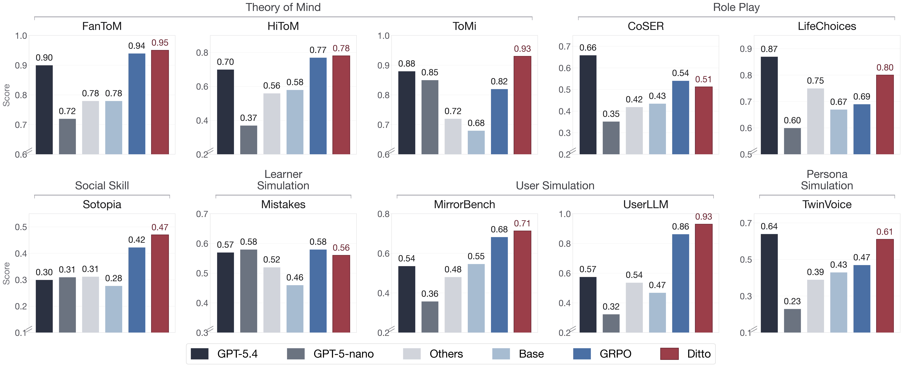
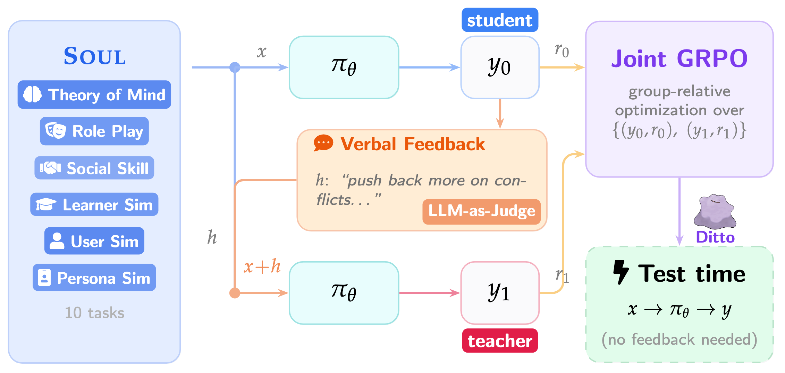
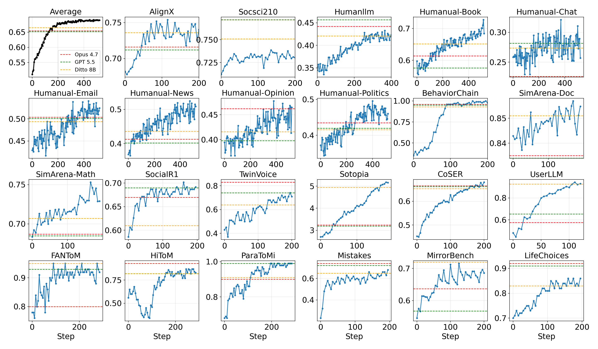
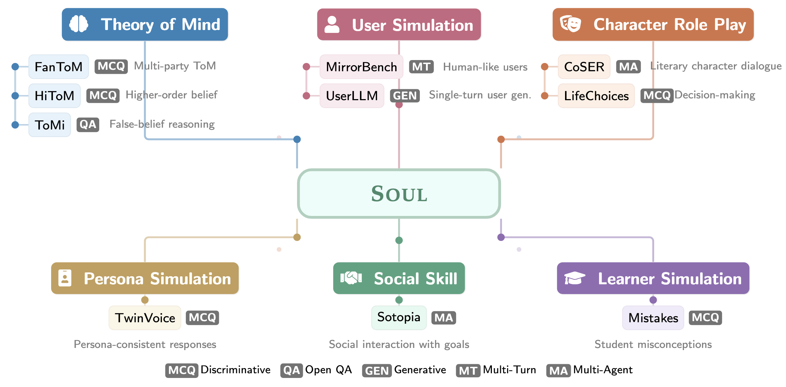

<div align="center">
  
  <h1 align="center">Reinforcing Human Behavior Simulation via Verbal Feedback</h1>

  [](https://opensource.org/licenses/Apache-2.0)
  [](http://arxiv.org/abs/2605.20506)
  [](https://huggingface.co/sunweiwei/Ditto-8B)
</div>


We are building a **human simulator** — a foundation model that imitates how
people think, feel, and act across scenarios. The next foundation model should
not just **answer** humans, but **be** one.

We present **Ditto**, a human simulator trained with
reinforcement learning from **verbal feedback**. Instead of collapsing
human-likeness into a scalar reward, Ditto learns from natural-language
critiques of its own behavior.

<div align="center">
  
</div>

### Features

- **Multi-agent RL** — built on top of [verl](https://github.com/volcengine/verl), with multi-turn, multi-agent RL for human-simulation training across interacting agents.
- **Learning from verbal feedback** — an efficient implementation of both *forward distillation* and *reverse distillation* (e.g., on-policy self-distillation) from LLM-judge critiques.
- **Unified evaluation suite Soul** — 20+ human-likeness tasks with matching training environments, sharing one framework with training so evaluation and RL rollouts run on the same stack.
- **Unified SFT/RL/evaluation framework** — SFT, RL, and both automatic and human evaluation share a single framework, ensuring a consistent train–eval match across every stage.

## News
[2026/05/20]🔥 We have released **Ditto**.

## Model Download

| Model    | Base                | Link                                                              |
| -------- | ------------------- | ----------------------------------------------------------------- |
| Ditto-8B | Qwen3-8B-Instruct   | [🤗 sunweiwei/Ditto-8B](https://huggingface.co/sunweiwei/Ditto-8B) |

[//]: # (## Benchmark)

## Setup

> **Note:** This repo is built on top of [verl v0.7.0](https://github.com/verl-project/verl/releases/tag/v0.7.0), with [this patch](https://github.com/sunnweiwei/OdysSim/commit/689ab593a24527ae0ac352b8419ee2bd61152c93) applied to support multi-agent RL (inherited from [FoldGRPO](https://github.com/sunnweiwei/FoldAgent)), on-policy distillation, and several model fixes.

Run inside the official verl 0.7.0 image `verlai/verl:vllm012.latest`.


### Code structure

```
verl/         Core RL training
agents/       Agent rollout loops
sft/          SFT training code
recipe/ditto/ Frozen recipe for the Ditto paper
data/         Data

run_rl.sh     RL entry — verbal-feedback RL or vanilla GRPO
run_opd.sh    RL entry — on-policy distillation
run_sft.sh    SFT entry
eval.sh       Eval-only across the full eval suite
train_ppo.py  PPO/GRPO trainer
train_sft.py  SFT trainer
```

## Data

Training and evaluation parquets live on HuggingFace:

| Split    | Dataset |
|----------|---|
| RL Train | [`sunweiwei/sim-rl-data`](https://huggingface.co/datasets/sunweiwei/sim-rl-data) |
| Eval     | [`sunweiwei/sim-eval-data`](https://huggingface.co/datasets/sunweiwei/sim-eval-data) |

```bash
huggingface-cli download sunweiwei/sim-rl-data   --repo-type dataset --local-dir data/sim_rl_data
huggingface-cli download sunweiwei/sim-eval-data --repo-type dataset --local-dir data/sim_eval_data
```

Each task has its own train / val parquet.

## RL

<div align="center">
  
</div>

Training is per-task. The `+algorithm.agent_version` flag in
`run_rl.sh` selects the objective:

- `copy` → **verbal-feedback RL**
- `default` → **vanilla GRPO**

The training loop calls an OpenAI-compatible judge model for verbal
critique / rewrite, so set the API env vars first:

```bash
export OPENAI_API_KEY=...                       # or your provider's key
export OPENAI_BASE_URL=https://api.openai.com/v1/
```

Then run one task:

```bash
bash run_rl.sh sotopia
```

Supported tasks: `sotopia`, `coser`, `lifechoices`, `userllm`,
`mirrorbench`, `fantom`, `hitom`, `paratomi`, `mistakes`, `twinvoice`,
`social_r1`, `behaviorchain`, `sim_math`, `sim_doc`,
`humanual_{book,chat,email,news,opinion,politics}`, `alignx`,
`socsci210`, `humanllm`.

[//]: # (<div align="center">)

[//]: # (  )

[//]: # (</div>)


## Evaluation

<div align="center">
  
</div>

`eval.sh` runs the full 27-task eval suite in two modes —
**local** (your trained checkpoint, or any open-source HF model, via
vLLM) and **api** (any OpenAI-compatible endpoint: OpenAI, Anthropic,
Gemini, DeepSeek, a local vLLM/SGLang server, ...).

```bash
# Eval the released Ditto-8B checkpoint
bash eval.sh local

# Eval your own trained checkpoint
ACTOR_MODEL_PATH=outputs/ditto-rl-sotopia/global_step_200 \
bash eval.sh local

# Eval an open-source HF model
ACTOR_MODEL_PATH=Qwen/Qwen3-8B-Instruct bash eval.sh local

# Eval an API model — OpenAI (GPT-5.5)
OPENAI_AGENT_MODEL=gpt-5.5 \
OPENAI_AGENT_BASE_URL=https://api.openai.com/v1/ \
OPENAI_AGENT_API_KEY=$OPENAI_API_KEY \
OPENAI_AGENT_REASONING_EFFORT=low \
bash eval.sh api

# Anthropic (Claude)
OPENAI_AGENT_MODEL=claude-opus-4-7 \
OPENAI_AGENT_BASE_URL=https://api.anthropic.com/v1/ \
OPENAI_AGENT_API_KEY=$ANTHROPIC_API_KEY \
OPENAI_AGENT_REASONING_EFFORT=low \
bash eval.sh api

# Google (Gemini, OpenAI-compatible endpoint)
OPENAI_AGENT_MODEL=gemini-3.1-pro-preview \
OPENAI_AGENT_BASE_URL=https://generativelanguage.googleapis.com/v1beta/openai/ \
OPENAI_AGENT_API_KEY=$GEMINI_API_KEY \
OPENAI_AGENT_REASONING_EFFORT=low \
bash eval.sh api

# DeepSeek
OPENAI_AGENT_MODEL=deepseek-chat \
OPENAI_AGENT_BASE_URL=https://api.deepseek.com/v1/ \
OPENAI_AGENT_API_KEY=$DEEPSEEK_API_KEY \
bash eval.sh api

# Local vLLM / SGLang server (OpenAI-compatible)
OPENAI_AGENT_MODEL=Qwen3-8B-Instruct \
OPENAI_AGENT_BASE_URL=http://localhost:8000/v1/ \
OPENAI_AGENT_API_KEY=EMPTY \
bash eval.sh api
```

## Citation

```bibtex
@article{sun2026ditto,
  title         = {Reinforcing Human Behavior Simulation via Verbal Feedback},
  author        = {Sun, Weiwei and Zhou, Xuhui and Liu, Jiarui and Du, Weihua and Sun, Haojia and Xie, Yiqing and Ma, Qianou and Chen, Sihao and Wan, Mengting and Yang, Longqi and Zhou, Pei and Wu, Sherry and Welleck, Sean and Neubig, Graham and Yang, Yiming and Sap, Maarten},
  year          = {2026},
  eprint        = {2605.20506},
  archivePrefix = {arXiv},
  url           = {http://arxiv.org/abs/2605.20506}
}
```